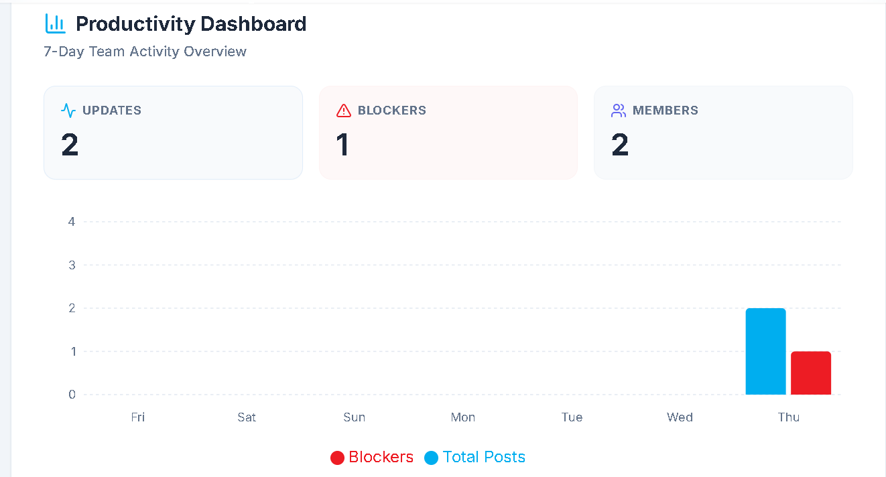

# KonvergeSync - Daily Activity Hub

An elegant, asynchronous daily standup logger built for the Konvergenz Network Solutions Software Engineering Team.

## Live Links

**Live Frontend Demo:**  
https://konvergesync-standup.vercel.app/

**Live API Endpoint:**  
https://konvergesync-standup.onrender.com/

---

## Application Preview

### Dashboard Screenshot



---

## Features

- **Async Standup Tracking** – Team members can log what they did yesterday, what they are doing today, and flag blockers.
- **Real-Time Polling** – The feed automatically syncs every 10 seconds. No page refreshes required.
- **Smart Productivity Dashboard** – A visually appealing bar chart tracks team activity and blocker frequency over a 7-day period.
- **Contextual Weather** – Integrates the Open-Meteo API to display real-time weather conditions for Nairobi, Kenya.
- **Modern UI/UX** – Built with Tailwind CSS featuring glassmorphism, responsive grid layouts, custom scrollbars, and Konvergenz brand colors.

---

## 🛠 Tech Stack

### Frontend
- React (Vite)
- Tailwind CSS
- Recharts (for analytics)
- Axios
- Date-fns
- Lucide React

### Backend
- Python
- Flask
- SQLAlchemy (SQLite Database)
- Flask-CORS
- Gunicorn

---

## Project Structure

```text
KonvergeSync-Daily-Activity-Hub/
│
├── backend/
│   ├── app.py
│   ├── requirements.txt
│   └── ...
│
├── frontend/
│   ├── src/
│   ├── public/
│   └── ...
│
├── dashboard.png
└── README.md
```

---

## Local Setup Instructions

### 1. Start the API (Backend)

Open your terminal, navigate into the backend directory, set up your Python virtual environment, and launch the Flask server.

```bash
# Navigate to the backend folder
cd backend

# Create and activate a virtual environment
python3 -m venv venv
source venv/bin/activate

# Install the required Python dependencies
pip install -r requirements.txt

# Start the Flask development server
python app.py
```

The backend should now be running on:

```text
http://localhost:5000
```

---

### 2. Start the Client (Frontend)

Open a new terminal window or tab, navigate to the frontend directory, install the necessary Node packages, and start the Vite development server.

```bash
# Return to the root directory, then navigate to the frontend folder
cd ../frontend

# Install the project dependencies
npm install

# Start the Vite development server
npm run dev
```

The frontend should now be accessible at:

```text
http://localhost:5173
```

---

## Key Functionality

### Daily Standup Submission
Team members can submit:
- What they worked on yesterday
- What they plan to work on today
- Any blockers preventing progress

### Live Activity Feed
The feed updates automatically every 10 seconds, ensuring all team members stay informed without manually refreshing the page.

### Productivity Analytics
The dashboard visualizes:
- Team activity trends
- Number of submissions
- Frequency of blockers over time

### Weather Integration
Real-time weather information for Nairobi, Kenya is displayed using the Open-Meteo API, providing useful environmental context for the team.

---

## Deployment

### Frontend
Hosted on **Vercel**

```text
https://konvergesync-standup.vercel.app/
```

### Backend
Hosted on **Render**

```text
https://konvergesync-standup.onrender.com/
```

---

## Author

Developed for the **Konvergenz Network Solutions Software Engineering Team**.

---

## License

This project is intended for educational, learning, and internal team collaboration purposes.